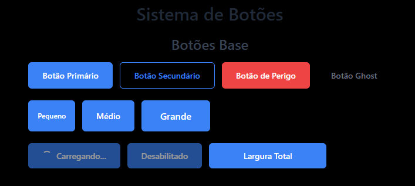
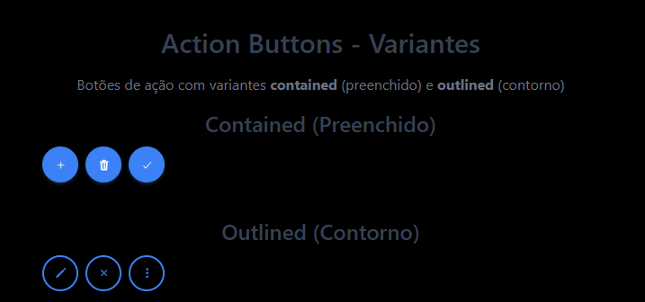
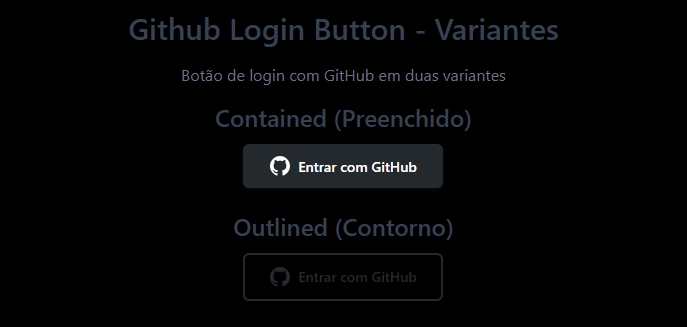

# Sistema de Botões

Este documento descreve o sistema de botões implementado seguindo os princípios da Arquitetura Hexagonal, SOLID e DDD.

## 📚 Documentação

- [🏠 README Principal](../../../README.md) - Documentação geral do projeto
- [📋 Front-end](../README.md) - Documentação do front-end
- [🔧 Back-end](../../../back-end/README.md) - Documentação do back-end

## Estrutura

```
src/presentation/components/Button/
├── Button/                    # Botão base com variantes
├── ActionButtons/            # Botões de ação específicos
├── IconButton/              # Botões de ícone redondos
├── GithubLoginButton/       # Botão de login GitHub
└── index.tsx               # Exportações centralizadas
```

## Exemplos Visuais

### Botões Base

Demonstração dos botões base com diferentes variantes e tamanhos:



### Action Buttons

Botões de ação específicos para operações CRUD e filtros:



### Github Login Button

Botão específico para login com GitHub:



## Componentes

### Button (Base)

Botão base com múltiplas variantes e tamanhos.

#### Props

- `variant`: 'primary' | 'secondary' | 'danger' | 'ghost'
- `size`: 'small' | 'medium' | 'large'
- `disabled`: boolean
- `loading`: boolean
- `children`: React.ReactNode

#### Exemplo

```tsx
<Button variant="primary" size="medium" onClick={handleClick}>
  Clique aqui
</Button>
```

### IconButton

Botão redondo para ícones com tooltip e múltiplas variantes.

#### Props

- `icon`: React.ReactNode
- `tooltip`: string (opcional)
- `variant`: 'primary' | 'secondary' | 'danger' | 'ghost' | 'contained' | 'outlined'
- `size`: 'small' | 'medium' | 'large'
- `disabled`: boolean
- `loading`: boolean
- `onClick`: () => void

#### Variantes

- **contained**: Background preenchido com sombra e efeito de elevação
- **outlined**: Contorno com preenchimento transparente (estilo GitHub)
- **primary**: Azul preenchido
- **secondary**: Contorno azul
- **danger**: Vermelho preenchido
- **ghost**: Transparente (padrão)

#### Exemplo

```tsx
<IconButton
  icon={<CreateIcon />}
  variant="contained"
  tooltip="Criar novo item"
  onClick={handleCreate}
/>
```

### ActionButtons

Conjunto de botões de ação específicos para operações CRUD e filtros.

#### Botões Disponíveis

**Operações CRUD:**

- `CreateButton`: Criar novo item (variant: contained)
- `EditButton`: Editar item (variant: outlined)
- `DeleteButton`: Excluir item (variant: contained)
- `ConfirmButton`: Confirmar ação (variant: contained)
- `CancelButton`: Cancelar ação (variant: outlined)
- `MoreButton`: Mais opções (variant: outlined)

**Filtros:**

- `AllTodosButton`: Ver todos (variant: outlined)
- `CompletedTodosButton`: Ver finalizados (variant: outlined)
- `PendingTodosButton`: Ver pendentes (variant: outlined)

**Ordenação:**

- `SortAZButton`: A-Z (variant: outlined)
- `SortZAButton`: Z-A (variant: outlined)
- `SortOldestButton`: Mais antigos (variant: outlined)
- `SortNewestButton`: Mais recentes (variant: outlined)

#### Exemplo

```tsx
import { CreateButton, EditButton, DeleteButton } from './ActionButtons';

<CreateButton onAction={handleCreate} />
<EditButton onAction={handleEdit} />
<DeleteButton onAction={handleDelete} />
```

### GithubLoginButton

Botão específico para login com GitHub, seguindo o design oficial.

#### Props

- `onClick`: () => void
- `onGithubLogin`: () => void
- `disabled`: boolean
- `loading`: boolean
- `variant`: 'contained' | 'outlined'

#### Variantes

- **contained**: Background preenchido com sombra (padrão)
- **outlined**: Contorno com preenchimento transparente

#### Exemplo

```tsx
<GithubLoginButton
  variant="contained"
  onClick={handleGithubLogin}
/>
<GithubLoginButton
  variant="outlined"
  onGithubLogin={handleGithubLogin}
/>
```

## Características

### Acessibilidade

- Todos os botões suportam `aria-label` e `aria-describedby`
- Navegação por teclado com `tabindex`
- Estados visuais para `disabled` e `loading`
- Tooltips informativos

### Responsividade

- Tamanhos adaptáveis (small, medium, large)
- Design mobile-first
- Transições suaves

### Variantes Visuais

- **Contained**: Background preenchido com sombra
- **Outlined**: Contorno com preenchimento transparente
- **Primary**: Azul principal
- **Secondary**: Azul secundário
- **Danger**: Vermelho para ações destrutivas
- **Ghost**: Transparente para ações sutis

## Testes

Cada componente possui testes unitários completos:

- Renderização correta
- Interações do usuário
- Estados (disabled, loading)
- Acessibilidade
- Variantes e tamanhos

## Uso na HomePage

Todos os botões estão disponíveis na HomePage para demonstração, organizados em seções:

- Botões Base
- Action Buttons (Contained/Outlined)
- Icon Buttons
- Github Login Button

## Princípios Aplicados

### Arquitetura Hexagonal

- Separação clara entre apresentação e lógica
- Componentes na camada de apresentação
- Props como contratos de interface

### SOLID

- **S**: Cada botão tem responsabilidade única
- **O**: Extensível através de variantes
- **L**: Substituível através de props
- **I**: Interfaces específicas por tipo
- **D**: Depende de abstrações (props)

### DDD

- Linguagem ubíqua nos nomes dos componentes
- Agregados bem definidos (Button, ActionButtons)
- Contextos delimitados (presentation/components)
