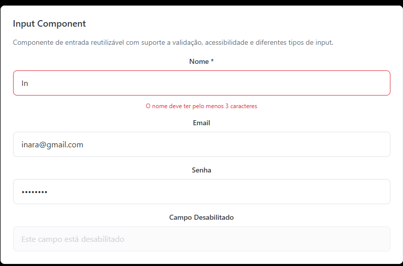

# Input Component

O componente `Input` é um elemento de entrada de dados reutilizável e acessível, construído com TypeScript e Styled Components. Ele oferece suporte completo a validação, diferentes tipos de entrada e acessibilidade.

## 📚 Documentação

- [🏠 README Principal](../../../README.md) - Documentação geral do projeto
- [📋 Front-end](../README.md) - Documentação do front-end
- [🔧 Back-end](../../../back-end/README.md) - Documentação do back-end



## Características

- ✅ **TypeScript**: Totalmente tipado sem uso de `any`
- ✅ **Acessibilidade**: Suporte completo a ARIA labels e roles
- ✅ **Validação**: Exibição de mensagens de erro
- ✅ **Responsivo**: Design adaptável a diferentes tamanhos de tela
- ✅ **Tema**: Integração completa com o sistema de design
- ✅ **Testes**: Cobertura completa de testes unitários

## Props

| Prop          | Tipo                                          | Obrigatório | Padrão   | Descrição                                  |
| ------------- | --------------------------------------------- | ----------- | -------- | ------------------------------------------ |
| `value`       | `string`                                      | ✅          | -        | Valor atual do input                       |
| `onChange`    | `(value: string) => void`                     | ✅          | -        | Função chamada quando o valor muda         |
| `onBlur`      | `() => void`                                  | ❌          | -        | Função chamada quando o input perde o foco |
| `error`       | `string`                                      | ❌          | -        | Mensagem de erro a ser exibida             |
| `placeholder` | `string`                                      | ❌          | -        | Texto de placeholder                       |
| `label`       | `string`                                      | ❌          | -        | Rótulo do campo                            |
| `type`        | `'text' \| 'email' \| 'password' \| 'number'` | ❌          | `'text'` | Tipo do input HTML                         |
| `disabled`    | `boolean`                                     | ❌          | `false`  | Se o input está desabilitado               |
| `required`    | `boolean`                                     | ❌          | `false`  | Se o campo é obrigatório                   |
| `id`          | `string`                                      | ❌          | -        | ID único do input                          |
| `name`        | `string`                                      | ❌          | -        | Nome do campo                              |
| `aria-label`  | `string`                                      | ❌          | -        | Label para acessibilidade                  |

## Uso Básico

```tsx
import { Input } from "@/presentation/components/Input";

const MyComponent = () => {
  const [value, setValue] = useState("");

  return (
    <Input
      label="Nome"
      placeholder="Digite seu nome"
      value={value}
      onChange={setValue}
    />
  );
};
```

## Exemplos

### Input com Validação

```tsx
const [value, setValue] = useState("");
const [error, setError] = useState("");

const handleChange = (newValue: string) => {
  setValue(newValue);

  if (newValue.length < 3 && newValue.length > 0) {
    setError("O nome deve ter pelo menos 3 caracteres");
  } else {
    setError("");
  }
};

<Input
  label="Nome"
  placeholder="Digite seu nome"
  value={value}
  onChange={handleChange}
  error={error}
  required
/>;
```

### Input de Email

```tsx
<Input
  label="Email"
  type="email"
  placeholder="Digite seu email"
  value={email}
  onChange={setEmail}
/>
```

### Input de Senha

```tsx
<Input
  label="Senha"
  type="password"
  placeholder="Digite sua senha"
  value={password}
  onChange={setPassword}
/>
```

### Input Desabilitado

```tsx
<Input
  label="Campo Desabilitado"
  placeholder="Este campo está desabilitado"
  value=""
  onChange={() => {}}
  disabled
/>
```

### Input com ID Personalizado

```tsx
<Input
  id="username-input"
  name="username"
  label="Nome de Usuário"
  placeholder="Digite seu nome de usuário"
  value={username}
  onChange={setUsername}
/>
```

## Estados Visuais

O componente Input possui diferentes estados visuais:

### Estado Normal

- Borda cinza (`theme.colors.gray[300]`)
- Fundo branco
- Transições suaves

### Estado de Foco

- Borda azul (`theme.colors.primary`)
- Box-shadow sutil para destaque
- Mantém a acessibilidade visual

### Estado de Erro

- Borda vermelha (`theme.colors.danger`)
- Mensagem de erro abaixo do campo
- `aria-invalid="true"`

### Estado Desabilitado

- Opacidade reduzida (0.6)
- Cursor `not-allowed`
- Fundo cinza claro
- Não responde a interações

### Estado Hover

- Borda muda para cor primária
- Transição suave

## Acessibilidade

O componente Input foi desenvolvido seguindo as melhores práticas de acessibilidade:

### ARIA Attributes

- `aria-label`: Label descritivo para leitores de tela
- `aria-invalid`: Indica se o campo tem erro
- `aria-describedby`: Associa mensagem de erro ao input
- `role="alert"`: Na mensagem de erro para notificação

### Keyboard Navigation

- Suporte completo a navegação por teclado
- Tab index automático
- Foco visual claro

### Screen Readers

- Labels associados corretamente
- Mensagens de erro anunciadas
- Indicador de campo obrigatório

## Estrutura de Arquivos

```
src/presentation/components/Input/
├── __tests__/
│   └── Input.test.tsx          # Testes unitários
├── Input.tsx                   # Componente principal
├── Input.style.ts              # Estilos Styled Components
├── Input.types.ts              # Definições TypeScript
└── index.ts                    # Exportações
```

## Testes

O componente possui cobertura completa de testes:

- ✅ Renderização com diferentes props
- ✅ Interações de usuário (change, blur)
- ✅ Estados de erro e validação
- ✅ Acessibilidade (ARIA attributes)
- ✅ Comportamento de campos obrigatórios
- ✅ Estados desabilitados
- ✅ Diferentes tipos de input

### Executar Testes

```bash
npm test -- --testPathPattern=Input.test.tsx
```

## Integração com Tema

O componente utiliza o sistema de design centralizado:

```tsx
// Cores
theme.colors.primary; // Cor principal
theme.colors.danger; // Cor de erro
theme.colors.gray[300]; // Cor da borda
theme.colors.dark; // Cor do texto

// Tipografia
theme.typography.fontSize.base;
theme.typography.fontWeight.medium;

// Espaçamento
theme.spacing.sm;
theme.spacing.md;
theme.spacing.lg;

// Bordas
theme.borderRadius.lg;
```

## Boas Práticas

### 1. Sempre forneça labels descritivos

```tsx
// ✅ Bom
<Input label="Endereço de Email" />

// ❌ Evite
<Input placeholder="Email" />
```

### 2. Use mensagens de erro claras e específicas

```tsx
// ✅ Bom
<Input error="O email deve ter um formato válido" />

// ❌ Evite
<Input error="Erro" />
```

### 3. Associe IDs quando necessário

```tsx
// ✅ Para formulários complexos
<Input id="user-email" name="email" label="Email" />
```

### 4. Use tipos apropriados

```tsx
// ✅ Para emails
<Input type="email" />

// ✅ Para senhas
<Input type="password" />

// ✅ Para números
<Input type="number" />
```
